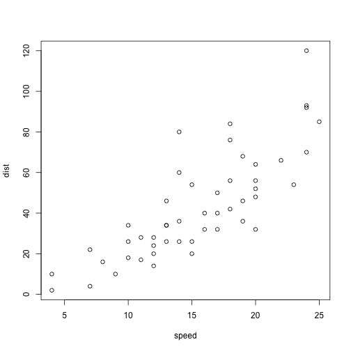

Presentation of the body mass index calculation tool
========================================================
author: Ugo Lancia
date: Fri Jan 15 20:13:01 2016

First Slide
========================================================

In my first shiny project I'd want to create something useful

===

## What is Body Mass Index

===
transition: rotate
## How BMI is calculated

It's a very simple formula relating your weight (in kilos) to your height squared (in meters)

$$\frac{w}{h^2}$$


- Bullet 1
- Bullet 2
- Bullet 3

Slide With Code
========================================================


```r
summary(cars)
```

```
     speed           dist       
 Min.   : 4.0   Min.   :  2.00  
 1st Qu.:12.0   1st Qu.: 26.00  
 Median :15.0   Median : 36.00  
 Mean   :15.4   Mean   : 42.98  
 3rd Qu.:19.0   3rd Qu.: 56.00  
 Max.   :25.0   Max.   :120.00  
```

Slide With Plot
========================================================

 
